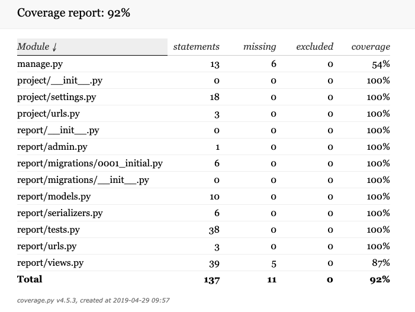
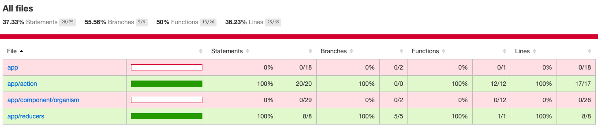

# Answer : Example Full-Stack Challenge

This repository is an answer to a given example full-stack challenge which consists of both UI app and server api app.

## UPDATE (29.04.19)

Here three things to be changed based on initial feedbacks from Mr.Joseph.

### 1. General Requirements

### 2. Unit-Tests

**Server**

* Find all of [test cases in server side](./server/app/report/tests.py)



**UI**

* Find all of [test cases in UI side](./ui/src/app/test/)



### 3. General Code Cleaning

## how to run

**Pre Requirements**

* latest `node` and `npm` is installed properly
* `docker` is installed properly

**Process**

1. Clone repository `git clone git@github.com:tatsuya-iskw/coding-challenge-answer.git`

2. Build docker image and run server app on a docker

```
$ cd ./coding-challenge-answer/server
$ docker-compose build --no-cache
$ docker-compose up
$ (open http://localhost:9980/reports) // If you need to see a raw json response
```

3. Install dependencies and run ui app on a local node dev server

```
$ cd ./coding-challenge-answer/ui
$ npm install
$ node bin/dev-server
$ open http://localhost:9911
```

## Tech-Stacks Overview

**UI**

* `ECMASCript` for basic logics
* `React` for view implementation
* `Redux` for app state(Model/Controller) management

**Server**

* `Python/Django` for a baseline web-framework
* `Sqlite` for a light-weight data persistent
* `Nginx/uWSGI` for a quick web server

## App Structure

**UI**

```
.
├── bin
│   └── dev-server.js
├── dist
│   └── index.html
├── package-lock.json
├── package.json
├── src
│   ├── app
│   │   ├── action
│   │   │   └── index.js
│   │   ├── component
│   │   │   └── organism
│   │   │       ├── MainScreen.js
│   │   │       └── rootContainer.js
│   │   ├── configureStore.js
│   │   ├── index.html
│   │   ├── index.js
│   │   └── reducers
│   │       └── index.js
│   └── sass
│       ├── component
│       │   └── organism
│       │       ├── mainScreen.scss
│       │       └── rootContainer.scss
│       └── main.scss
└── webpack.config.js

11 directories, 15 files
```

**Server**

```
.
├── Dockerfile
├── app
│   ├── db.sqlite3
│   ├── manage.py
│   ├── project
│   │   ├── __init__.py
│   │   ├── settings.py
│   │   ├── urls.py
│   │   └── wsgi.py
│   ├── report
│   │   ├── __init__.py
│   │   ├── admin.py
│   │   ├── apps.py
│   │   ├── initial_data
│   │   │   ├── __init__.py
│   │   │   ├── is_data_initialized.txt
│   │   │   └── reports.py
│   │   ├── migrations
│   │   │   ├── 0001_initial.py
│   │   │   └── __init__.py
│   │   ├── models.py
│   │   ├── populate_data_from_docker_build.py
│   │   ├── tests.py
│   │   ├── urls.py
│   │   └── views.py
│   └── requirements.txt
├── conf
│   ├── nginx-app.conf
│   └── supervisor-app.conf
├── docker-compose.yml
├── docker-scripts
│   ├── django-migrate.sh
│   ├── initialize-data.sh
│   └── start.sh
├── uwsgi.ini
└── uwsgi_params

7 directories, 29 files
```

## Notes

* Used personal minimum boiler-plate project to bootstrap fundamental structure in both side
* In general, focus on functional implementation in a give time, therefoere some factors are ignored such as:
  * No usage on css framework in ui app (such as material-ui)
  * Business logics in server are built by pure django functions (No Django REST-Framework)
  * Turn off general CROS check functions in server side
  * Simplified a data structure based on a give data structure

## Things Noticed (After Notes on 29.04.19)

* ImmutableJS for reducer logic handling
* react-saga for http request handling (also makes unit-test easier)